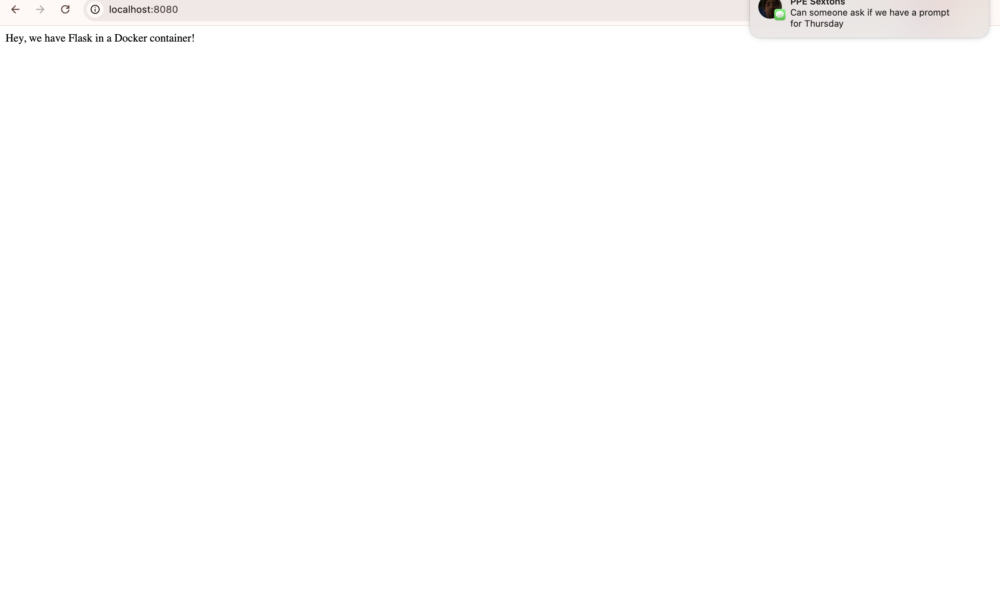

# Flask in Docker

This project demonstrates a minimal Flask web application running inside a Docker container. The application is containerized using Ubuntu 16.04 and Python 3, and exposes a simple route accessible through a mapped port.

## Application Demo

